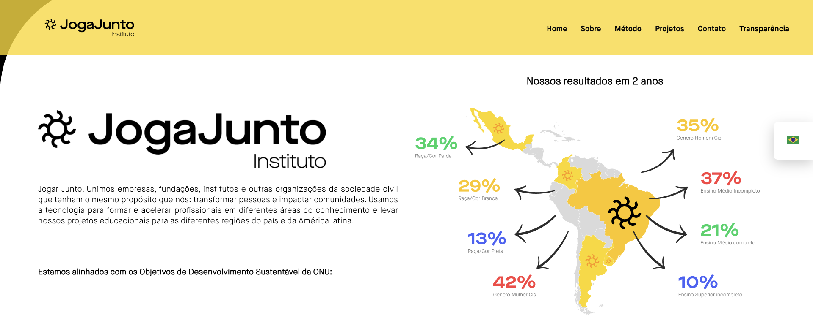
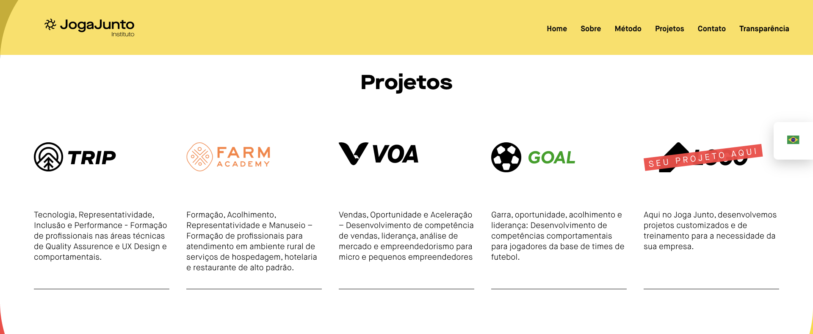

<h1 align="center">   </h1>

<h1 align="center">  Insitituto Joga Junto - Bugou tá on - Curso de QA 🐞   </h1>

	
  
  
  
  
  
  

 

# ⚽️ Método Joga Junto

Joga Junto!

Desenvolvemos uma sistemática educacional que consiste em três etapas evolutivas de aprendizagem unindo o técnico e comportamental. Engajamos os alunos para a aprendizagem por meio de trocas sociais, desenvolvemos competências comportamentais, estimulamos o autoconhecimento e facilitamos o reconhecimento dos valores pessoais e do contexto de vida.

# 🛠 Modulo 4 - Deixa que eu testo - Tecnologias utilizadas para realizar testes de API

- [Postman](https://www.postman.com/)
- [API - Joga Junto](http://apilivro.jogajuntoinstituto.org:8000/swagger/)

# 💎 Equipe - Squad5 - Orion

- Renato Fabricio
- Katie Cristiane Guedes Lima
- Ester Batista Rocha Brito de Oliveira
- Joseane da Silva Guedes

# 🧑‍🤝‍🧑 Saiba mais sobre o Instituto Joga Junto

- Acesse 👉🏼 [IJJ](https://www.jogajuntoinstituto.org/)

<h1 align="center">   </h1>

# 📚 License

Released in 2021 📚 License

This project is under the [MIT license](./LICENSE).

#
